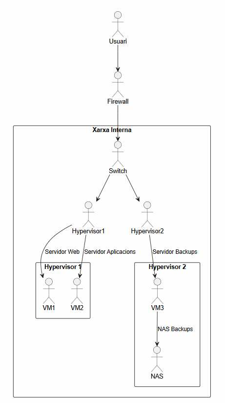
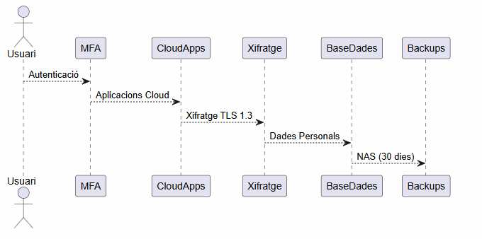
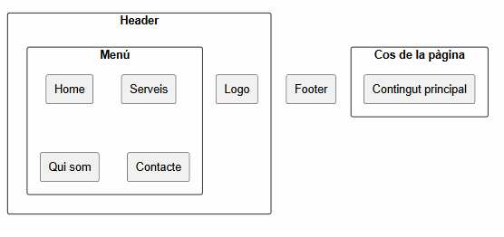

# MEMÒRIA TÈCNICA DE LA PROPOSTA

**Autors:** Anthony Milla i Nil Lozano     
**Client:** FoodLogístic S.A.

## 1. Introducció

**Context del projecte:**

FoodLogístic S.A. vol modernitzar la seva infraestructura tecnològica, millorar la seguretat i disposar d’una presència digital professional que reflecteixi la seva activitat i valors corporatius.

**Descripció del client:**

FoodLogístic S.A. és una empresa dedicada a la gestió logística i distribució de productes alimentaris, especialitzada en:

- Transport i distribució a temperatura controlada.
- Gestió d’estocs i magatzems.
- Subministrament a supermercats, restaurants i distribuïdors.
- Operacions 24/7 amb alta exigència de traçabilitat i fiabilitat.

El seu entorn operatiu requereix continuïtat de servei, seguretat de dades, coordinació interna eficient i una imatge corporativa sòlida.

**Objectius de la proposta:**

- Modernitzar la infraestructura TI i garantir alta disponibilitat.
- Implementar serveis al núvol per millorar la productivitat.
- Garantir seguretat i compliment RGPD.
- Desenvolupar una web corporativa funcional, moderna i legal.

**En conclusió:**  

La proposta integra infraestructura, serveis cloud, seguretat i web corporativa per garantir eficiència, continuïtat i creixement futur.

## 2. Anàlisi de necessitats

**Problemes detectats i solucions:**

| Problema                   | Impacte            | Solució                     |
|---------------------------|--------------------|-----------------------------|
| Infraestructura antiquada | Risc de fallades   | Migració a entorn virtualitzat |
| Comunicació interna deficient | Baixa productivitat | Suite col·laborativa cloud |
| Falta de seguretat        | Vulnerabilitat     | MFA, xifratge, firewall     |
| Sense web corporativa     | Mala imatge        | Web moderna + RGPD          |

**Necessitats del client:**

- Disponibilitat 24/7
- Seguretat reforçada
- Comunicació eficient
- Web corporativa legal

**Requisits tècnics:**

- Escalabilitat
- Redundància
- Integració cloud
- Compliment RGPD

## 3. Proposta de solució

| 3.1 Infraestructura i alta disponibilitat |
|----------------------------------------|

**Descripció:**

Infraestructura basada en servidors virtualitzats, amb redundància, còpies de seguretat i firewall perimetral.

**Diagrama d’arquitectura (PlantUML);**

**Codi:**

```
@startuml
skinparam rectangleStyle rounded
skinparam shadowing false

actor Usuari as U

U --> Firewall

rectangle "Xarxa Interna" {
    Firewall --> Switch
    Switch --> Hypervisor1
    Switch --> Hypervisor2

    rectangle "Hypervisor 1" {
        Hypervisor1 --> VM1 : Servidor Web
        Hypervisor1 --> VM2 : Servidor Aplicacions
    }

    rectangle "Hypervisor 2" {
        Hypervisor2 --> VM3 : Servidor Backups
        VM3 --> NAS : NAS Backups
    }
}
@enduml
```



**Components:**

| Component          | Funció          | Quantitat | Justificació             |
|--------------------|-----------------|-----------|---------------------------|
| Firewall           | Protecció       | 1         | Seguretat                |
| NAS                | Backups         | 1         | Recuperació de desastres |
| Servidors virtuals | Serveis interns | 2         | Escalabilitat            |

| 3.2 Serveis al núvol |
|----------------------------------------|

**Comparativa:**

| Característica   | Google Workspace | Microsoft 365 |
|------------------|------------------|----------------|
| Correu           | Gmail            | Outlook        |
| Emmagatzematge   | Drive            | OneDrive       |
| Col·laboració    | Docs/Sheets      | Office Online  |
| Preu             | €                | €€             |

**Justificació:**

Hem escollit Microsoft 365 per integració empresarial, seguretat i eines completes d’ofimàtica.

| 3.3 Seguretat i LOPD |
|----------------------------------------|

**Mesures de seguretat:**

- Autenticació multifactor (MFA) per a tots els usuaris.
- Xifratge de dades en repòs i en trànsit (TLS 1.3).
- Polítiques de contrasenyes robustes i renovació periòdica.
- Control d’accessos basat en rols (RBAC).
- Còpies de seguretat automàtiques al NAS amb retenció de 30 dies.
- Tallafocs perimetral amb filtres i monitoratge continu.
- Actualitzacions i pegats de seguretat programats.

**Compliment LOPD / RGPD - Relació amb normativa:**

- Registre d’activitats de tractament.
- Consentiment explícit en formularis web.
- Política de privacitat i cookies visible i accessible.
- Dades personals xifrades i amb accés restringit.
- Procediment de resposta davant incidents.
- Mesures tècniques i organitzatives documentades.

**Taula resum:**

| Àrea          | Mesura                        | Compliment |
|---------------|--------------------------------|------------|
| Accés         | MFA + RBAC                     | Sí.        |
| Dades         | Xifratge + control d'accés     | Sí.        |
| Backups       | NAS + retenció 30 dies         | Sí.        |
| Web           | Cookies + privacitat + consentiment | Sí.   |
| Infraestructura | Firewall + monitoratge        | Sí.        |

**Esquema de seguretat (PlantUML);**

**Codi:**

@startuml
skinparam rectangleStyle rounded
skinparam shadowing false

actor Usuari

Usuari --> MFA : Autenticació
MFA --> CloudApps : Aplicacions Cloud
CloudApps --> Xifratge : Xifratge TLS 1.3
Xifratge --> BaseDades : Dades Personals
BaseDades --> Backups : NAS (30 dies)

@enduml



| 3.4 Presència web |
|----------------------------------------|

**Diagrama Wireframe Web (PlantUML);**

**Codi:**

@startuml
skinparam rectangleStyle rounded
skinparam shadowing false

rectangle "Header" {
    rectangle "Logo"
    rectangle "Menú" {
        rectangle "Home"
        rectangle "Serveis"
        rectangle "Qui som"
        rectangle "Contacte"
    }
}

rectangle "Cos de la pàgina" {
    rectangle "Contingut principal"
}

rectangle "Footer"

@enduml



**Descripció funcional:**

- Home corporativa
- Serveis
- Qui som
- Contacte amb formulari
- Polítiques legals

**Requisits legals:**

- Avís legal
- Política de privacitat
- Política de cookies
- Banner de consentiment
- Check RGPD al formulari

## 4. Arquitectura i disseny tècnic

**Relació entre sistemes:**

**Els sistemes del projecte interactuen de manera coordinada;**

- **Infraestructura local ->** allotja servidors virtuals, backups i serveis interns.
- **Firewall ->** controla i filtra tot el trànsit entre la xarxa interna, la web i el núvol.
- **Web corporativa ->** allotjada externament, connecta amb serveis interns només quan cal (formulari, consultes).
- **Microsoft 365 ->** gestiona correu, documents i col·laboració; sincronitza amb usuaris interns.
- **NAS ->** rep còpies de seguretat automàtiques dels servidors i dades crítiques.

**En resum:** tots els sistemes treballen junts per garantir disponibilitat, seguretat i flux de dades estable entre infraestructura local, web i serveis cloud.

**Funcionament global:**

La solució integra infraestructura, serveis cloud, web pública i sistemes de seguretat en un ecosistema coherent i escalable.

**Diagrama global (Mermaid);**

**Codi:**

@startuml

skinparam rectangleStyle rounded

skinparam shadowing false


actor Usuari


Usuari --> Web : Accés Web Corporativa


rectangle "Infraestructura Web" {

    Web --> Hosting

    Hosting --> CDN

}


CDN --> Firewall


rectangle "Serveis Cloud" {

    Firewall --> M365 : Microsoft 365

    M365 --> Correu

    M365 --> OneDrive

}


rectangle "Infraestructura Local" {

    Firewall --> Servidors

    Servidors --> NAS : Backups

}


@enduml


[Anar a l'enunciat](../Producte01/README.md)      
[Anar a la pàgina inicial](../README.md)
