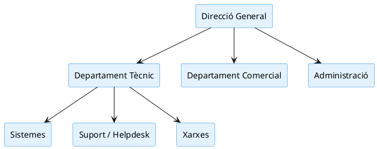

# Introducció

Hem muntat la nostra pròpia empresa de serveis informàtics a Mataró. Tot just estem arrencant la nostra activitat professional de forma independent i ens acaba d'entrar el primer gran client potencial: FoodLogístic S.A., una empresa de logística alimentària ubicada al Polígon de les Hortes del Camí Ral.

Necessiten una renovació a fons de la seva infraestructura tecnològica i per a la nostra empresa és una gran oportunitat per assegurar un client a llarg termini. Però compte, no som els únics a la ciutat. Haurem de presentar una proposta competitiva que convenci a l’equip directiu de FoodLogístic i, per fer-ho, primer hem d’entendre com funciona el sector i qui és la nostra competència.

---

# Fase 1: Coneixent el terreny i la competència

## 1. Recerca de mercat (3 empreses reals del Maresme)

### Empreses identificades

#### Market Software (Mataró)
- **Mida:** Microempresa
- **Tipus de serveis:** Botiga informàtica, reparacions i manteniment bàsic

#### Digitalnet Serveis Informàtics (Mataró)
- **Mida:** Microempresa
- **Tipus de serveis:** Suport tècnic, manteniment, xarxes i serveis a empreses

#### Extreme Micro (Mataró)
- **Mida:** Microempresa
- **Tipus de serveis:** Reparació d’equips, muntatge de PCs i suport tècnic

### Enllaços: 

**Market Software (Mataró):**

- https://marketmataro.com/

**Digitalnet Serveis Informàtics (Mataró):**

- https://digitalnet.cat/

**Extreme Micro (Mataró):**

- https://pyming.com/ca_ES

Totes tres són **microempreses (1–9 treballadors)**, típiques del sector informàtic local.

---

## 2. Organigrama – Digitalnet Serveis Informàtics (Mataró)

Organigrama d’una microempresa de serveis informàtics (Digitalnet Serveis Informàtics). Fet amb PlantUML.

### Codi

---

## 3. Radiografia de departaments (versió Digitalnet)

### Departament Tècnic
- **Sistemes:** Gestió de servidors, còpies de seguretat, virtualització, seguretat i monitorització.
- **Suport / Helpdesk:** Atenció d’incidències, resolució de problemes d’usuari, instal·lacions bàsiques i assistència remota.
- **Xarxes:** Configuració i manteniment de routers, switches, WiFi, VPN i infraestructura de comunicacions.
- **Projectes / Implementació:** Instal·lacions, migracions, desplegaments i posada en marxa de solucions tècniques.

### Departament Comercial
- Captació de clients
- Elaboració de pressupostos
- Gestió de contractes de manteniment
- Relació amb empreses

### Gestió de Clients / Contractes
- Seguiment de clients
- Renovacions
- Control de SLA
- Comunicació postvenda
- Coordinació de serveis

### Administració
- Facturació
- Comptabilitat
- Gestió de proveïdors
- Documentació
- Organització interna

### Direcció General
- Presa de decisions
- Estratègia
- Planificació
- Gestió global de l’empresa

---

# Fase 2: Estratègia

## 1. Estratègia: Proposta de valor

Com que som només dues persones, la nostra estratègia ha de jugar amb els nostres punts forts naturals.

### 1) Proximitat i tracte directe
- Les empreses petites del Maresme valoren parlar sempre amb la mateixa persona.
- No hi ha centraletes, ni bots, ni derivacions a altres departaments.
- Ens diferencia de les empreses més grans.
- **Valor afegit:** confiança i relació humana.

### 2) Resposta ràpida (24 h)
- Les microempreses locals sovint tenen problemes urgents: TPV, impressora o xarxa.
- Complir una resposta en 24 h ens posiciona per davant de la competència.
- **Valor afegit:** seguretat per al client.

### 3) Preus clars i transparents
- Evitem sorpreses en la factura.
- Oferim manteniments simples i preus tancats.
- **Valor afegit:** tranquil·litat i control de costos.

### 4) Especialització en PIMEs
- No competim amb grans consultores.
- Ens centrem en negocis petits: botigues, restaurants, oficines i autònoms.
- **Valor afegit:** solucions adaptades i assequibles.

### Proposta de valor final

> **Som una empresa propera del Maresme que ofereix suport informàtic ràpid, personal i transparent per a petites empreses.**

---

## 2. Recursos humans necessaris

Som dues persones, així que repartim les funcions de manera eficient.

### Tècnic principal
**Funcions:**
- Sistemes (servidors, còpies, seguretat)
- Xarxes (routers, switches, WiFi, VPN)
- Instal·lacions i manteniments presencials
- Projectes tècnics complexos

**Per què?**

És necessari disposar d'una figura experta que aporti solvència tècnica i confiança al client.

### Suport + Administració
**Funcions:**
- Helpdesk i gestió d’incidències
- Configuracions bàsiques
- Facturació i pressupostos
- Gestió de clients
- Organització i planificació

**Per què?**

Allibera el tècnic principal de tasques repetitives i assegura una bona gestió interna.

### Som suficients?

**Sí, per començar, sempre que:**
- S’organitzin bé les tasques
- No se superin els 10–15 clients de manteniment
- Es disposi d’eines bàsiques (ticketing, control remot i còpies)

### Quan caldrà ampliar l’equip?
- Excés d’incidències
- Projectes tècnics grans
- Increment del volum administratiu

### Solucions intermèdies
- Subcontractar un tècnic júnior per hores
- Col·laborar amb freelancers

### Conclusió

L’estructura i estratègia definides permeten oferir un servei professional, eficient i adaptat al volum d’una microempresa, assegurant qualitat des del primer dia i possibilitat de creixement sostenible.

[Anar a l'enunciat](../Tasca01/README.md)      
[Anar a la pàgina inicial](../README.md)
