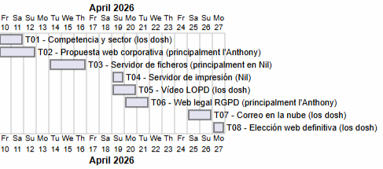

# Fase 1: Anàlisi real del projecte (pensament estructural)
## 1.1 Identificació de tasques i dependències

A partir de les tasques reals del projecte (T01–T08):

- **Identifiqueu:**       
**Ordre lògic d’execució**         
T05 (Vídeo formatiu LOPD empleats)                     
T01 (Coneixent la competència i el sector)                
T02 (Creant la proposta de pàgina corporativa)               
T06 (Operació Escut Digital: Fent 100% legal la web de FoodLogístic S.A.)             
T08 (Tria de la web definitiva.)         
T03 (Servidor de fitxers)          
T07 (Migrant al cloud.)                        
T04 (Servidor d’impressió)                          

**Tasques que poden anar en paral·lel**          
La T07 i T01. La T02 i la T06. Les demés lliure ja que son en parelles i fan servir els dos pc’s.

**Tasques bloquejants**                    
La T02 perquè sense la T01 no es pot fer (ja que és introductori, per saber on estem i per conèixer la competència del sector si no anem una mica a cegues), la T04 amb la T03 (perquè van lligades, si no has fet la T03 doncs la T04 no la pots fer sense haver fet això primerament) i la T08 amb T02 (ja que a la T02 creem la web i a la T08 és la tria de la web definitiva, si no tens web, no pots fer-ho aleshores aquesta tasca és necessària de fer-la abans per poder fer aquesta tasca).

**Heu de respondre preguntes com:**                      
**Quines tasques no poden començar sense haver-ne acabat una altra?**                    
**On poden aparèixer colls d’ampolla?**                         
Doncs la T02 perquè sense la T01 no es pot fer, la T04 amb la T03 (ja que van lligades, si no has fet la T03 doncs la T04 no la pots fer sense haver fet això primerament) i la T08 amb T02 (perquè a la T02 creem la web i a la T08 doncs és la tria de la web definitiva, si no tens web, no pots fer-ho aleshores aquesta tasca és necessària de fer-la abans per poder fer aquesta tasca).

**Quines tasques són més crítiques per al projecte?**
T05 perquè és bàsicament formar als empleats.                          
T01 perquè primer s’ha de conèixer la competència del sector.                            
T06 perquè s’ha de conèixer legalment el que es deu posar a la web.                        
T02 perquè s’ha de crear una maqueta de la web corporativa.                        

## 1.2 Identificació del camí crític
**Determineu:**
- **Quines tasques, si es retarden, afecten tot el projecte**                            
T05 ja que és bàsicament formar als empleats.                                     
T01 perquè primer s’ha de conèixer la competència del sector.                        
T06 ja que s’ha de conèixer legalment el que es deu posar a la web.                      
T02 perquè s’ha de crear una maqueta de la web corporativa.                      
T03 perquè aquesta tasca és important tenir-la feta, ja que després per la T04 (Servidor d’impressió) necessitarem tenir feta aquesta tasca correctament.                    
T04 ja que hem de tenir feta correctament la T03 (Servidor de fitxers) sense errors i sense problemes per no tenir problemes a l’hora de fer aquesta tasca.                    
Ja que si no fem aquestes tasques s'endarrerira tot el projecte, són llargues i si no les fem a temps ens dificultara.             

- **Quines tenen marge (slack)**                        
T05 (Vídeo formatiu LOPD empleats) ja que és un vídeo formatiu i, encara que pot ser llarg, si es fa corresponentment no hauria de donar cap problema el vídeo (és una introducció només, és senzill).                                                    
T01 (Coneixent la competència i el sector) ja que és només introductori i per saber on estem.
T02 (Creant la proposta de pàgina corporativa) perquè és la creació de proposta de pàgina corporativa, no és molt complicada aquesta tasca en aquest cas.                              
T08 (Tria de la web definitiva) ja que és triar la web definitiva, decidir i veure la millor opció. No és tan complex en general de dificultat, encara que has d'escollir amb criteri.                

# Fase 2: Estimació d’esforç amb criteri (ús d’IA guiat)

Heu d’estimar la durada de cada tasca en hores, però no de forma arbitrària.                 
Per cada tasca, haureu d’analitzar com a mínim aquests factors:                           
Factors obligatoris d’estimació                                  
Per cada tasca, tingueu en compte:                                      

- Temps de comprensió (lectura, anàlisi)
- Temps de recerca (si cal)
- Temps d’implementació tècnica
- Temps de proves i errors
- Temps de documentació
- Coordinació amb l’equip
- Possibles interrupcions (classes, exàmens, altres tasques)
- Temps de marge (imprevistos)

# Ús d’IA (obligatori i guiat)

Heu d’utilitzar IA com a assistent, però amb criteri.

#### **T01 – Coneixent la competència i el sector**

**Estimació total:** 4 hores  
- Comprensió de l’activitat: 30 min  
- Recerca d’empreses i informació: 1,30 h  
- Organigrama amb PlantUML: 45 min  
- Documentació i redacció final: 45 min  
- Coordinació + marge lleu: 30 min  

**T01: 4 h**

---

#### **T02 – Proposta de pàgina corporativa**

**Estimació total:** 5 hores  
- Comprensió requisits GitHub Pages: 30 min  
- Recerca / inspiració web: 30 min  
- Implementació web (HTML/CSS + desplegament): 2,30 h  
- Proves bàsiques: 1,10 h  
- README i captures: 1,10 h  
- Marge lleu: 10 min  

**T02: 5 h**

---

#### **T03 – Servidor de fitxers**

**Estimació total:** 6 hores  
- Comprensió i planificació: 50 min  
- Implementació carpetes, permisos, GPO, FSRM: 3 h  
- Proves amb usuaris: 50 min  
- Documentació tècnica: 1 h  
- Marge lleu: 20 min  

**T03: 6 h**

---

#### **T04 – Servidor d’impressió**

**Estimació total:** 3 hores  
- Comprensió de la tasca: 30 min  
- Configuració impressió i pool: 1,30 h  
- Proves i GPO: 30 min  
- Documentació: 15 min  
- Marge: 15 min  

**T04: 3 h**

---

#### **T05 – Vídeo formatiu LOPD**

**Estimació total:** 4 hores  
- Comprensió + esquema: 30 min  
- Recerca normativa (AEPD): 1 h  
- Guió + gravació / edició: 1,30 h  
- Revisió i ajustos: 30 min  
- Llistat de fonts i lliurament: 30 min  

**T05: 4 h**

---

#### **T06 – Adaptació web normativa legal**

**Estimació total:** 3 hores  
- Comprensió normativa: 30 min  
- Recerca textos legals: 30 min  
- Implementació a la web: 1,20 h  
- Prova formulari + cookies: 30 min  
- Marge lleu: 10 min  

**T06: 3 h**

---

#### **T07 – Migrant al cloud**

**Estimació total:** 4 hores  
- Comprensió del cas: 30 min  
- Recerca serveis (M365, Google…): 1,30 h  
- Comparativa i càlcul costos: 1 h  
- Redacció proposta: 45 min  
- Marge: 15 min  

**T07: 4 h**

---

#### **T08 – Tria de la web definitiva**

**Estimació total:** 2 hores  
- Anàlisi individual: 30 min  
- Debat i consens d’equip: 45 min  
- Documentació del procés: 30 min  
- Marge: 15 min  

**T08: 2 h**

### **Resum final ajustat**

| **Tasca** | **Hores** |
|----------|----------|
| T01 | 4 h |
| T02 | 5 h |
| T03 | 6 h |
| T04 | 3 h |
| T05 | 4 h |
| T06 | 3 h |
| T07 | 4 h |
| T08 | 2 h |
| **TOTAL** | **31 hores** |

### **Fase 3: Assignació de recursos (treball en equip real)**

Distribuïu les tasques entre els membres de l’equip:
- Qui fa què
- Si hi ha tasques compartides
- Si hi ha dependència entre membres

👉 **Heu d’evitar:**
- Sobrecàrrega d’una persona
- Temps morts en altres

---

### **Distribució detallada de tasques (Qui fa què)**

#### **T01 - Coneixent la competència i el sector (4 h)**

**Tasques compartides (necessita 2 persones)**

- **Nil**
  - Recerca d’empreses TIC del Maresme
  - Anàlisi tècnica dels serveis oferts

- **Anthony**
  - Organigrama amb PlantUML
  - Redacció de l’estratègia i proposta de valor

- **Treball conjunt**
  - Validació final del document

---

#### **T02 - Proposta de pàgina corporativa (5 h)**

**Tasca dividida però coordinada**

- **Nil**
  - Supervisió tècnica
  - Validació estructura GitHub Pages

- **Anthony**
  - Desenvolupament principal de la web (HTML/CSS)
  - Integració StatCounter
  - README i captures

---

#### **T03 - Servidor de fitxers (6 h)**

**Responsable principal + suport puntual**

- **Nil**
  - Configuració del servidor
  - Permisos NTFS, SMB, GPO, FSRM

- **Anthony**
  - Proves amb usuaris
  - Suport en la documentació tècnica

- **Treball conjunt**
  - Validació final del funcionament

---

#### **T04 - Servidor d’impressió (3 h)**

**Responsable únic**

- **Nil**
  - Instal·lació del rol
  - Configuració printer pooling
  - GPO de desplegament

---

#### **T05 - Vídeo formatiu LOPD (4 h)**

**Tasques compartides (necessita 2 persones)**

- **Nil**
  - Recerca normativa (AEPD, RGPD)
  - Validació legal del contingut

- **Anthony**
  - Guió
  - Gravació / edició del vídeo

- **Treball conjunt**
  - Revisió final del contingut

---

#### **T06 - Adaptació web a la normativa legal (3 h)**

**Responsable principal + revisió**

- **Anthony**
  - Creació d’avís legal, privacitat i cookies
  - Implementació de checkboxes i banner

- **Nil**
  - Revisió normativa i validació final

---

#### **T07 - Migrant al cloud (4 h)**

**Responsable principal + suport**

- **Nil**
  - Recerca de serveis (Microsoft 365, Google Workspace…)
  - Càlcul de costos

- **Anthony**
  - Taula comparativa
  - Redacció de la proposta comercial

---

#### **T08 - Tria de la web definitiva (2 h)**

**Tasques compartides (necessita 2 persones)**

- **Nil**
  - Avaluació tècnica de les propostes

- **Anthony**
  - Avaluació visual i d’usabilitat

- **Treball conjunt**
  - Debat, consens i documentació del procés

### **Taula**

| **Tasca** | **Nil** | **Anthony** | **Compartida** |
|----------|--------|------------|---------------|
| T01 | ✅ | ✅ | ✅ |
| T02 | ✅ (revisió) | ✅ (principal) | ⚠️ |
| T03 | ✅ (principal) | ✅ (suport) | ⚠️ |
| T04 | ✅ | ❌ | ❌ |
| T05 | ✅ | ✅ | ✅ |
| T06 | ✅ (revisió) | ✅ (principal) | ⚠️ |
| T07 | ✅ | ✅ | ⚠️ |
| T08 | ✅ | ✅ | ✅ |

### **Fase 4: Construcció del diagrama de Gantt (UMLTree)**

Utilitzant **PlantUML (UMLTree)**, el diagrama ha de mostrar:

- Tasques del projecte (T01–T08)
- Durada de cada tasca
- Dependències entre tasques
- Execució en paral·lel
- Visió temporal de les 3 setmanes

👉 **No és només un dibuix:** ha de reflectir decisions reals.

Script:                                       
@startgantt                                        
Project starts the 2026-04-10                                           
[T01 - Competencia y sector (los dosh) ] lasts 2 days                                               
[T02 - Propuesta web corporativa (principalment l'Anthony)] lasts 3 days                                            
[T03 - Servidor de ficheros (principalment en Nil)] starts at 2026-04-14 and lasts 3 days                                         
[T04 - Servidor de impresión (Nil)] starts at 2026-04-19 and lasts 1 day                                          
[T05 - Vídeo LOPD (los dosh)] starts at 2026-04-19 and lasts 2 days                                         
[T06 - Web legal RGPD (principalment l'Anthony)] starts at 2026-04-20 and lasts 2 days                                       
[T07 - Correo en la nube (los dosh)] starts at 2026-04-25 and lasts 2 days                                       
[T08 - Elección web definitiva (los dosh)] starts at 2026-04-27 and lasts 1 day                                        
@endgantt                             

### **Fase 5: Pla de contingència (pensament professional)**

**Identifiqueu com a mínim:**

- **2 riscos crítics** (reals, invasió zombi o abducció d’un alien no val)

Que estiguis creant una màquina virtual per exemple a la **T03 (Servidor de fitxers)** i no es pugui obrir per falta d'espai a l'ordinador.  

Que falli la connexió a l’escola i no puguis fer pràcticament cap tasca, penjar qualsevol cosa al github, fer documentació, no es guardi la teva feina…etc  

Configurar malament una màquina virtual o qualsevol configuració en una tasca, com la **T03 (Servidor de fitxers)**.  

Que a la **T02 (Creant la proposta de pàgina corporativa)** la pàgina corporativa no estigui completa o amb les dades corresponents.  

Tot això ens pot fer endarrerir-nos, haver de començar de nou i en definitiva ser riscos crítics que ens retardin.

---

### **Impacte en el projecte**

Ens pot fer endarrerir el fet d’estar creant una màquina virtual per exemple a la **T03 (Servidor de fitxers)** i no es pugui obrir per falta d'espai a l'ordinador.  

No poder fer res perquè falli la connexió a l’escola i no puguis fer pràcticament cap tasca, penjar qualsevol cosa al github, fer documentació, no es guardi la teva feina…etc  

Haver de començar de nou per configurar malament una màquina virtual o qualsevol configuració en una tasca, com la **T03 (Servidor de fitxers)**.  

Doncs haver d'arreglar la pàgina corporativa, quasi començar de nou, perdre molt de temps perquè a la **T02 (Creant la proposta de pàgina corporativa)** la pàgina corporativa no estigui completa o amb les dades corresponents.

---

### **Estratègia de mitigació**

Vigilar l’espai de l’ordinador contínuament, per així en crear una màquina no tenir problemes d’espai i no endarrerir-nos (si tenim molt d’espai, per intentar alliberar espai doncs esborrar arxius o carpetes innecessaris, que no utilitzem…etc).

Anar guardant seguidament el treball que anem fent, per així no perdre res de feina.

Configurar correctament la màquina virtual, vigilar de no equivocar-se amb res que, a més, pot ser molt greu i complicar-te la feina.

Anar vigilant amb eines com **OneCompiler** o **Canvas de Gemini** per veure com va quedant la web amb el codi corresponent, això ho podem fer abans de publicar la pàgina corporativa perquè aixis sabem com va quedant la web aixis no agafem el risc directament de publicar la web malament (amb dades incorrectes per exemple, que no estigui ben feta, estructurada…) o simplement ens fixem que hem posat totes les dades i que tot estigui complet.

[Anar a l'enunciat](../Tasca09/README.md)      
[Anar a la pàgina inicial](../README.md)
